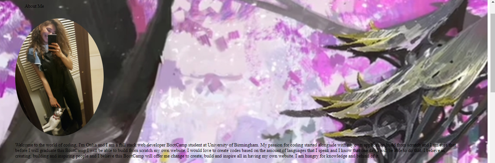
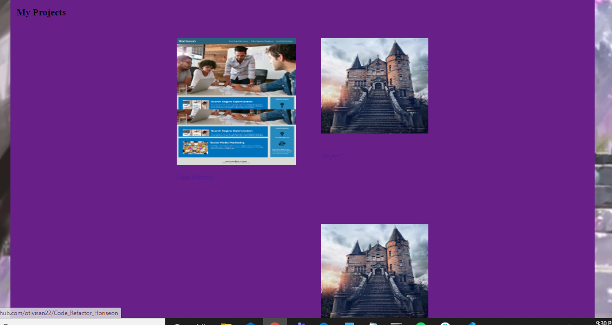
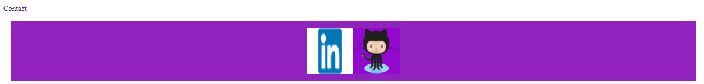
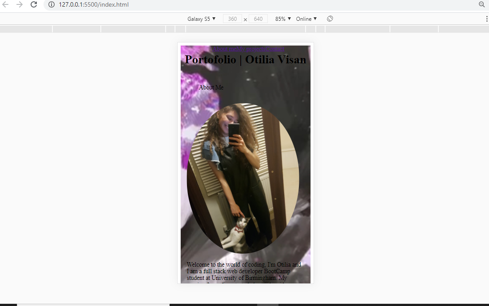

## My Professional Portofolio

# Project Link

Click here to view project on GitHub Pages https://otivisan22.github.io/My_Professional_Portofolio/
cd my_profesional_portofolio

## Description

My professional Portofolio has been build from scratch using HTML Semantic Elements alongside with CSS.

# Getting started

- Clone the GitHub project into your local machine
- Navigate into the project
- Open the project into VSCode
- Open the 'index.html' into your default browser

git clone git@github.com: git@github.com:otivisan22/My_Professional_Portofolio
code .

# What I did?

- Added a more complex title for this project
- Used Semantic HTML Elements
- Each image has its attribute
- Formatted code using lint (prettier)
- Formatted the CSS style according to the HTML Semantic elements
- Used flexbox and media queries in order to have a more accessible and clean styling format
- Created a functional navbar

# Screenshots

# Testing

- A series of tests were performed and established after each block or styled has been added
